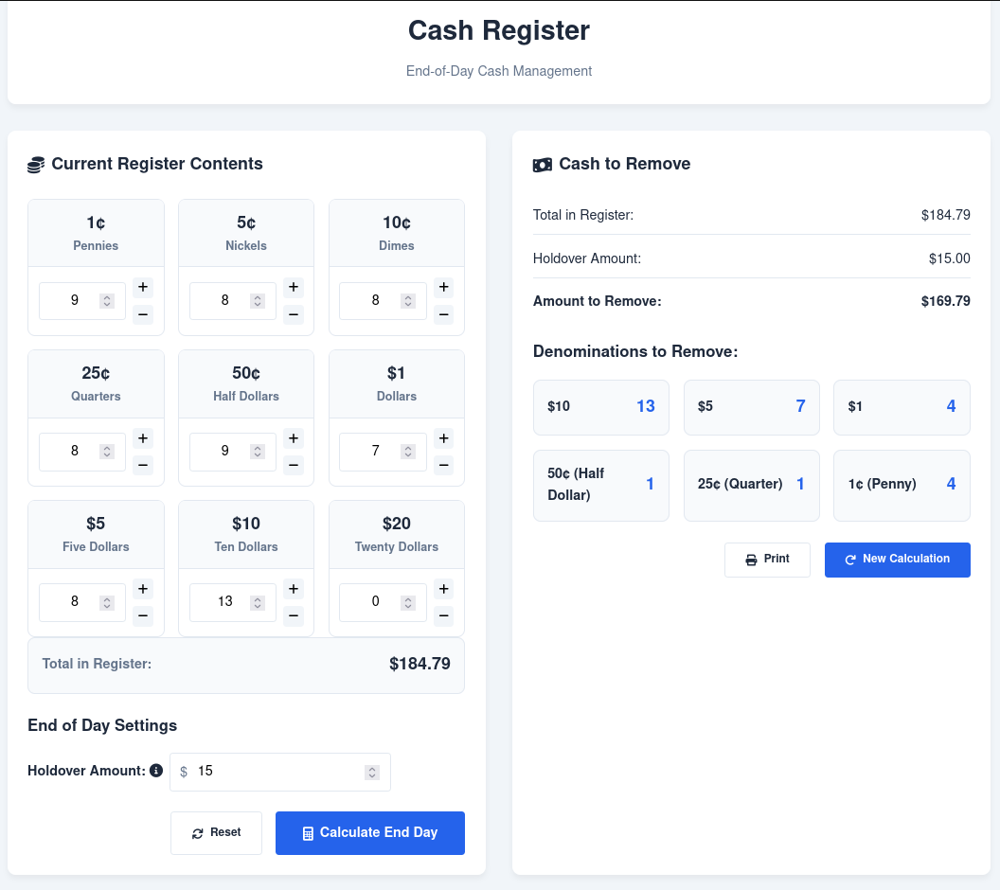

# Cash Register Project
A web-based cash register system that calculates the coins to be removed at the end of the day to match a specified holdover amount. Built with Go (backend), HTML/CSS (frontend), and JavaScript (client-side logic).

---
## Features
- **Backend**:
  - Go server with Gorilla Mux for routing.
  - Cash register logic to calculate coin removal using a greedy algorithm.
  - RESTful API for processing end-of-day calculations.
- **Frontend**:
  - User-friendly interface to input coin quantities and holdover amount.
  - Dynamic updates using JavaScript and AJAX.
- **Error Handling**:
  - Backend validation for negative values and invalid inputs.
  - Frontend error messages for invalid requests.
---
## Prerequisites
- **Go**: Install Go from [https://golang.org/dl/](https://golang.org/dl/).
- **Git**: Install Git from [https://git-scm.com/](https://git-scm.com/).
---
## How to Run
1. **Clone the repository**:
   ```bash
   git clone https://github.com/yourusername/cash-register.git
   cd cash-register
   ```

2. **Install dependencies**:
   ```bash
   go mod download
   ```

3. **Build the application**:
   ```bash
   go build
   ```

4. **Run the server**:
   ```bash
   ./cash-register
   ```
   Or on Windows:
   ```bash
   cash-register.exe
   ```

5. **Access the application**:
   Open your web browser and navigate to:
   ```
   http://localhost:8080
   ```

6. **Using the application**:
   - Enter the quantities of each coin denomination in your register
   - Enter your desired holdover amount
   - Click "Calculate" to see which coins should be removed
---